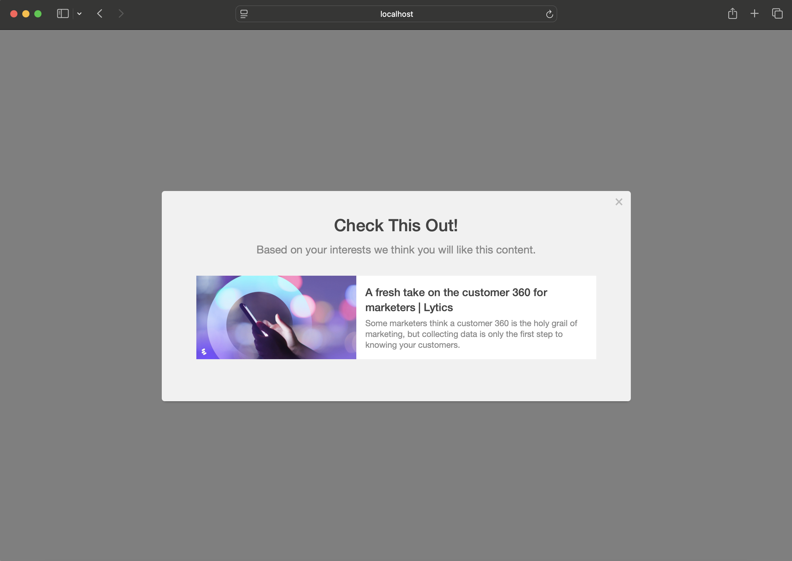

Instead of hand selecting content to show an audience, you can can create a module that will suggest content at a individual level, based on the viewer's content affinities in Lytics.

**Note**: only [Message](../types/message) modules using a [slideout](../layouts/slideout), [modal](../layouts/modal) or [modal](../layouts/inline) layout and a [variant](../layouts/modal#variant) of `3` support content recommendations.

## recommend

Recommend controls any parameters necessary for making a content suggestions to a user using the Lytics content recommendation API.

<table>
  <thead>
    <tr>
      <td colspan="3" align="center"><code>recommend</code> object</td>
    </tr>
    <tr>
      <th>Key</th>
      <th>Type</th>
      <th>Behavior</th>
    </tr>
  </thead>

  <tr>
    <td>collection</td>
    <td>string</td>
    <td>id of a content collection - the source list of content to recommend from**</td>
  </tr>

  <tr>
    <td>rollups</td>
    <td>array</td>
    <td>if supplied, only allow recommendations of documents with topics from the specified topic rollups</td>
  </tr>

  <tr>
    <td>visited</td>
    <td>boolean</td>
    <td>if false, only recommend an article the user has not previously visited.</td>
  </tr>

  <tr>
    <td>shuffle</td>
    <td>boolean</td>
    <td>if true, randomly shuffle the recommendations to show a different recommendation on each page load</td>
  </tr>

  <tr>
    <td>rank</td>
    <td>string</td>
    <td>must be one of <code>popular</code> (prioritizes most popular documents), <code>recent</code> (prioritizes most recent documents), or <code>affinity</code> (prioritizes based on user affinity - default)</td>
  </tr>

  <tr>
    <td>display</td>
    <td>object</td>
    <td>additional settings to control the appearance of the recommendation (see below)</td>
  </tr>

</table>

** You can get the id of the content collection from the url of that collection in the Lytics App.

<table>
  <thead>
    <tr>
      <td colspan="3" align="center"><code>display</code> object</td>
    </tr>
    <tr>
      <th>Key</th>
      <th>Type</th>
      <th>Behavior</th>
    </tr>
  </thead>

  <tr>
    <td>title</td>
    <td>boolean</td>
    <td>if false, do not show the title of the recommended content</td>
  </tr>

  <tr>
    <td>image</td>
    <td>boolean</td>
    <td>if false, do not show the meta image of the recommended content</td>
  </tr>

  <tr>
    <td>description</td>
    <td>boolean</td>
    <td>if false, do not show the meta description of the recommended content</td>
  </tr>

  <tr>
    <td>author</td>
    <td>boolean</td>
    <td>if true, display the author of the recommended content</td>
  </tr>

  <tr>
    <td>date</td>
    <td>boolean</td>
    <td>if false, display the published date of the recommended content</td>
  </tr>

  <tr>
    <td>descriptionLimit</td>
    <td>int</td>
    <td>limit the number of characters in the meta description preview, a value of -1 removes the limit</td>
  </tr>

  <tr>
    <td>locale</td>
    <td>string</td>
    <td><a href="https://developer.mozilla.org/en-US/docs/Web/JavaScript/Reference/Global_Objects/Date/toLocaleDateString#Using_locales">locale</a> to be used to format the published date</td>
  </tr>

  <tr>
    <td>dateOptions</td>
    <td>object</td>
    <td><a href="https://developer.mozilla.org/en-US/docs/Web/JavaScript/Reference/Global_Objects/Date/toLocaleDateString#Using_options">options</a> to be used to format the published date</td>
  </tr>
</table>

## content

Content acts as a backfill/helper for the [recommend key](#recommend). If the content recommendation API cannot return a recommendation for the user (if they don't have any content affinity data or an error occurs), a default document may be provided.

<table>
  <thead>
    <tr>
      <td colspan="3" align="center">object in <code>content</code> array</td>
    </tr>
    <tr>
      <th>Key</th>
      <th>Type</th>
      <th>Behavior</th>
    </tr>
  </thead>

  <tr>
    <td>url</td>
    <td>string</td>
    <td>url of the default document to recommend to the user</td>
  </tr>
  <tr>
    <td>title</td>
    <td>string</td>
    <td>meta title of the default document</td>
  </tr>
  <tr>
    <td>description</td>
    <td>string</td>
    <td>meta description of the default document</td>
  </tr>
  <tr>
    <td>image</td>
    <td>string</td>
    <td>url of the meta image of the default document</td>
  </tr>
  <tr>
    <td>author</td>
    <td>string</td>
    <td>full name of the author of the document</td>
  </tr>
  <tr>
    <td>date</td>
    <td>string</td>
    <td>ISO 8601 formatted date that the document was published</td>
  </tr>
  <tr>
    <td>default</td>
    <td>boolean</td>
    <td><code>required</code> true if the content provided is to be used should the recommendation fail</td>
  </tr>
</table>

**Note:** The examples below will show the default content since the account used does not have content affinity set up.

<h3>Content Recommendation Modal - <a href="../examples/preview/layouts/modal/contentRecommend.html" target="_blank">Live Preview</a></h3>

<pre data-src="../examples/src/layouts/modal/contentRecommend.js"></pre>

<h3>Content Recommendation Slideout - <a href="../examples/preview/layouts/slideout/contentRecommend.html" target="_blank">Live Preview</a></h3>

<pre data-src="../examples/src/layouts/slideout/contentRecommend.js"></pre>
