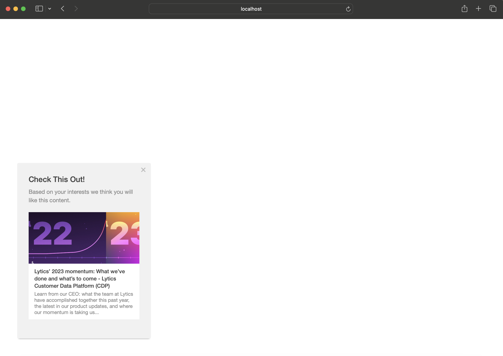

Lytics content recommendations are now supported as a **beta** feature in Pathfora. Instead of hand selecting content to show an audience, you can can create a module that will suggest content at a individual level, based on the viewer's content affinities in Lytics. If you would like to try out this feature _please_ contact your customer success representative `success@lytics.io` to help set this up.

**Note**: only [Message](/types/message.md) modules using a [slideout](/layouts/slideout.md), [modal](/layouts/modal.md) or [modal](/layouts/inline.md) layout and a [variant](/layouts/modal.md#variant) of `3` support content recommendations.

## recommend

Recommend controls any parameters necessary for making a content suggestions to a user using the Lytics content recommendation API.

<table>
  <thead>
    <tr>
      <td colspan="3" align="center"><code>recommend</code> object</td>
    </tr>
    <tr>
      <th>Key</th>
      <th>Type</th>
      <th>Behavior</th>
    </tr>
  </thead>
  
  <tr>
    <td>ql</td>
    <td>object</td>
    <td>additional parameters using FilterQL to filter and select documents (see below)</td>
  </tr>

  <tr>
    <td>topics</td>
    <td>array</td>
    <td>if supplied, only allow recommendations of documents with the specified topics</td>
  </tr>

  <tr>
    <td>rollups</td>
    <td>array</td>
    <td>if supplied, only allow recommendations of documents with topics from the specified topic rollups</td>
  </tr>

  <tr>
    <td>visited</td>
    <td>boolean</td>
    <td>if false, only recommend an article the user has not previously visited.</td>
  </tr>

  <tr>
    <td>shuffle</td>
    <td>boolean</td>
    <td>if true, randomly shuffle the recommendations to show a different recommendation on each page load</td>
  </tr>

  <tr>
    <td>path</td>
    <td>string</td>
    <td>url path (excluding domain) to filter recommended documents (ex. "/blog/posts" returns documents with urls containing this path)</td>
  </tr>

  <tr>
    <td>domain</td>
    <td>string</td>
    <td>domain of acceptable documents to return (ex. "developers.getlytics.com")</td>
  </tr>

  <tr>
    <td>from</td>
    <td>string</td>
    <td>recommend only documents that were published after this ISO 8601 formatted date</td>
  </tr>

  <tr>
    <td>to</td>
    <td>string</td>
    <td>recommend only documents that were published before this ISO 8601 formatted date</td>
  </tr>

  <tr>
    <td>rank</td>
    <td>string</td>
    <td>must be one of <code>popular</code> (prioritizes most popular documents), <code>recent</code> (prioritizes most recent documents), or <code>affinity</code> (prioritizes based on user affinity - default)</td>
  </tr>

  <tr>
    <td>collection</td>
    <td>string</td>
    <td>id or slug of a content collection (segment on the content table) to filter content</td>
  </tr>

  <tr>
    <td>ast</td>
    <td>object</td>
    <td>Content segment AST expression to filter documents (see below)</td>
  </tr>

</table>

<table>
  <thead>
    <tr>
      <td colspan="3" align="center"><code>ql</code> object</td>
    </tr>
    <tr>
      <th>Key</th>
      <th>Type</th>
      <th>Behavior</th>
    </tr>
  </thead>
  
  <tr>
    <td>raw</td>
    <td>string</td>
    <td>raw FilterQL formatted query ex. <code>FILTER AND (global.mobile_experience > 0) FROM content</code>*</td>
  </tr>
</table>

<table>
  <thead>
    <tr>
      <td colspan="3" align="center"><code>ast</code> object</td>
    </tr>
    <tr>
      <th>Key</th>
      <th>Type</th>
      <th>Behavior</th>
    </tr>
  </thead>
  
  <tr>
    <td>args</td>
    <td>array</td>
    <td>list of arguments to be evaluated with the operator. These arguments may be identifiers, literals, or further expressions*</td>
  </tr>

  <tr>
    <td>op</td>
    <td>string</td>
    <td>operator to be used to evaluate the arguments of the expression</td>
  </tr>
</table>

*Contact your customer success representative `success@lytics.io` for assistance in writing a FilterQL statement or Segment AST expression to recommend based on url matching, topic relevance, and/or meta attributes.

## content

Content acts as a backfill/helper for the [recommend key](#recommend). If the content recommendation API cannot return a recommendation for the user (if they don't have any content affinity data or an error occurs), a default document may be provided.

<table>
  <thead>
    <tr>
      <td colspan="3" align="center">object in <code>content</code> array</td>
    </tr>
    <tr>
      <th>Key</th>
      <th>Type</th>
      <th>Behavior</th>
    </tr>
  </thead>
  
  <tr>
    <td>url</td>
    <td>string</td>
    <td>url of the default document to recommend to the user</td>
  </tr>
  <tr>
    <td>title</td>
    <td>string</td>
    <td>meta title of the default document</td>
  </tr>
  <tr>
    <td>description</td>
    <td>string</td>
    <td>meta description of the default document</td>
  </tr>
  <tr>
    <td>image</td>
    <td>string</td>
    <td>url of the meta image of the default document</td>
  </tr>
  <tr>
    <td>default</td>
    <td>boolean</td>
    <td><code>required</code> true if the content provided is to be used should the recommendation fail</td>
  </tr>
</table>

**Note:** The examples below will show the default content since the account used does not have content affinity set up.

<h3>Content Recommendation Modal - <a href="../examples/preview/layouts/modal/contentRecommend.html" target="_blank">Live Preview</a></h3>

<pre data-src="../examples/src/layouts/modal/contentRecommend.js"></pre>

<h3>Content Recommendation Slideout - <a href="../examples/preview/layouts/slideout/contentRecommend.html" target="_blank">Live Preview</a></h3>

<pre data-src="../examples/src/layouts/slideout/contentRecommend.js"></pre>