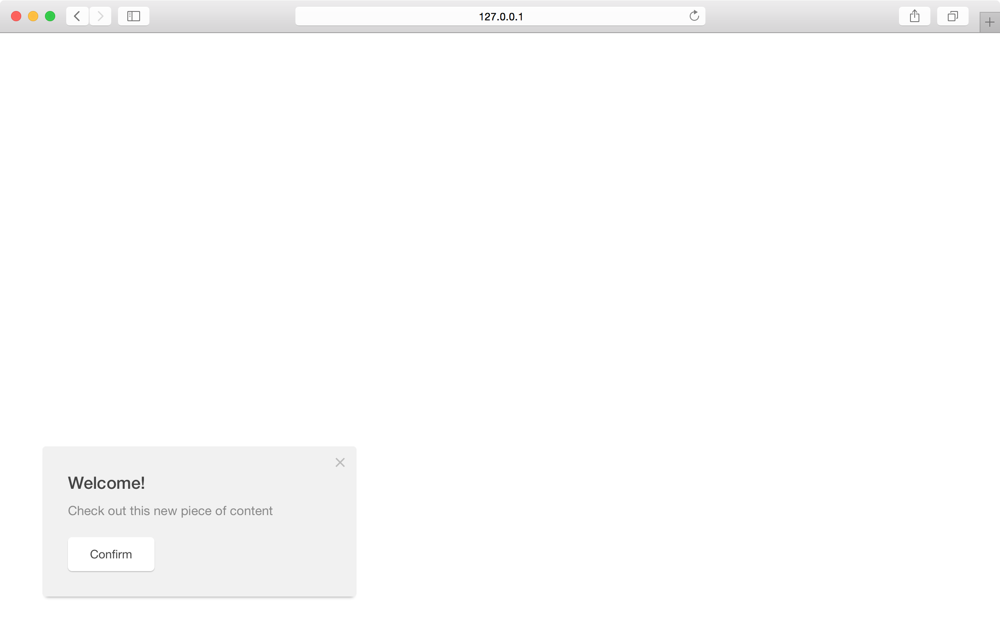

Pathfora modules can have up to two action buttons "confirm" and "cancel". You can set custom text for these buttons as well as select to hide one or both of them. See the [callbacks](/callbacks.md) section for how to add javascript callbacks on these buttons.

## okShow

Show or hide the "Confirm" button.

<table>
  <thead>
    <tr>
      <td colspan="2" align="center"><code>okShow</code> boolean</td>
    </tr>
    <tr>
      <th>Value</th>
      <th>Behavior</th>
    </tr>
  </thead>
  
  <tr>
    <td>true</td>
    <td><code>default</code> module has confirm button</td>
  </tr>
  <tr>
    <td>false</td>
    <td>module does not have confirm button</td>
  </tr>
</table>

## cancelShow

Show or hide the "Cancel" button.

<table>
  <thead>
    <tr>
      <td colspan="2" align="center"><code>cancelShow</code> boolean</td>
    </tr>
    <tr>
      <th>Value</th>
      <th>Behavior</th>
    </tr>
  </thead>
  
  <tr>
    <td>true</td>
    <td><code>default</code> module has cancel button</td>
  </tr>
  <tr>
    <td>false</td>
    <td>module does not have cancel button</td>
  </tr>
</table>

<h3>Hide Cancel Button - <a href="../../examples/preview/customization/buttons/cancelShow.html" target="_blank">Live Preview</a></h3>

<pre data-src="../../examples/src/customization/buttons/cancelShow.js"></pre>

## okMessage

Set the text for the "Confirm" button.

<table>
  <thead>
    <tr>
      <th>Key</th>
      <th>Value</th>
      <th>Behavior</th>
    </tr>
  </thead>
  
  <tr>
    <td>confirmMessage</td>
    <td>string</td>
    <td>set custom text for the module's confirm button</td>
  </tr>
</table>

## cancelMessage

Set the text for the "Cancel" button.

<table>
  <thead>
    <tr>
      <th>Key</th>
      <th>Value</th>
      <th>Behavior</th>
    </tr>
  </thead>
  
  <tr>
    <td>cancelMessage</td>
    <td>string</td>
    <td>set custom text for the module's cancel button</td>
  </tr>
</table>

<h3>Custom Button Text - <a href="../../examples/preview/customization/buttons/buttonMessage.html" target="_blank">Live Preview</a></h3>

<pre data-src="../../examples/src/customization/buttons/buttonMessage.js"></pre>
