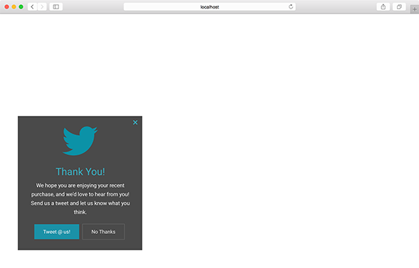

Pathfora is built to be entirely customizable for developers. With the javascript config alone you can [change the colors](../themes) of any element of the module. But, to make your module fully fit the look and feel of your site you can add custom CSS.

## Key Class Names

The outer most `<div>` of all Pathfora modules have the `pf-widget` class. For most modules this will be the containing div surrounding the content, but for [modal](../../layouts/modal) and [gate](../../types/gate) modules this div will contain the full-screen overlay behind the module. `pf-widget` has a number of useful subclasses to help select modules by their settings from the javascript config.

**Subclasses of `pf-widget`:**

| Class Name | Use |
|---|---|
| `pf-[type]` | select modules by type |
| `pf-widget-[layout]` | select modules by layout |
| `pf-position-[position]` | select modules by position |  
| `pf-widget-variant-[variant]` | select modules by variant |
| `opened` | added once the module becomes visiable to the user, can be used for changing the transition animation |

Within the `pf-widget` div most key elements are assigned class names. Form components are nested in a `<form>` element and should be selected and styled by element type.

**Key Classes:**

| Class Name | Element |
|---|---|
| `pf-widget-content` | second container div inside `pf-widget` (for modal and gate layouts this will the the box surrounding the actual module content) |
| `pf-widget-text` | third container div inside `pf-widget` for modals, gates, and inline layouts (it contains the text: headline and message/form) |
| `pf-widget-headline` | `<h2>` headline text |
| `pf-widget-message` | `<p>` containing widget message text |  
| `pf-widget-close` | "x" icon to close the modal |
| `pf-widget-btn` | general class for all buttons |
| `pf-widget-ok` | "Confirm" button |
| `pf-widget-cancel` | "Cancel" button |
| `pf-widget-img` | image element for modules of [variant 2](../../layouts/modal#variant)

To see these classes in action, you can view the html [templates](https://github.com/lytics/pathforajs/tree/master/src/templates) that will be rendered on your website. This is the html that gets minified, and added to a div with the class `pf-widget`. That div then gets added to the DOM of your website.


## Custom Class Name

All modules use the `pf-widget` class and thus any styles applied to this class and sub-elements will effect all modules used on the page. If you want to select and style a single module without using its `id` as a selector, you can add a custom class name to the `pf-widget` div in your javascript config.

```javascript
var module = new pathfora.Subscription({
  id: 'form-css',
  className: 'sign-up-newsletter',
  layout: 'modal',
  headline: 'Sign Up!',
  msg: 'Submit this form to get updates'
});

pathfora.initializeWidgets([module]);
```

## Example

<h3><a href="../../examples/preview/customization/css/custom.html" target="_blank">Live Preview</a></h3>



### Javascript

<pre data-src="../../examples/src/customization/css/custom.js"></pre>


### CSS

<pre data-src="../../examples/src/customization/css/custom.css"></pre>

### SASS/LESS

``` css
.pf-widget {
  &.pf-twitter-module {
    background-color: #4a4a4a;
    color: #fff;
    border-radius: 0px;
    box-shadow: none;
    font-family: Roboto, Arial, 'sans-serif';

    /* message paragraph */
    .pf-widget-message {
      font-size: 15px;
      line-height: 1.7;
    }

    /* headline */
    .pf-widget-headline {
      font-size: 28px;
    }

    .pf-widget-close, .pf-widget-headline {
      color: #39aec0;
    }

    /* buttons */
    .pf-widget-btn {
      border-radius: 0px;
      padding: 1px 25px;
    }

    /* confirm button */
    .pf-widget-btn.pf-widget-ok {
      background-color: #1b91a7;
      color: #fff;
      box-shadow: none;
    }

    /* cancel button */
    .pf-widget-btn.pf-widget-cancel {
      background: transparent;
      color: #fff;
      border: 1px solid #6a6a6a;
    }

    /* img */
    .pf-widget-img {
      border-radius: 0px;
    }
  }
}
```
