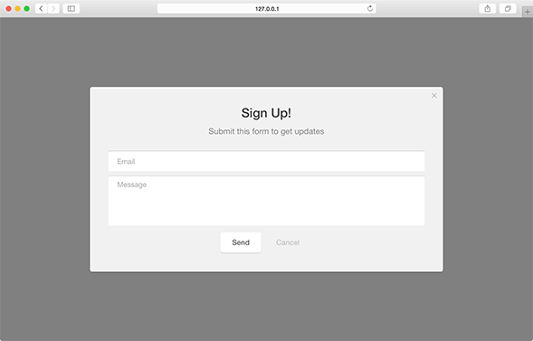
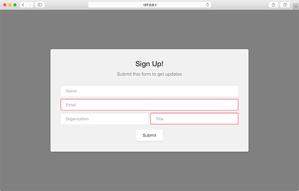
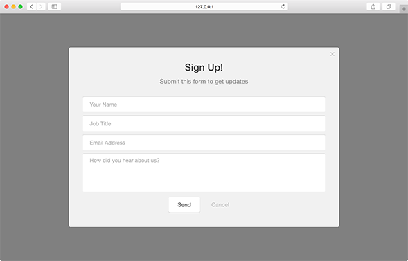

Pathfora allows for some customization on form elements including hiding specific input fields, setting placeholder text, and selecting which fields are required for the user to submit the form.

## fields

Select which fields should be a part of the module's form. By default, all available fields for 

<table>
  <thead>
    <tr>
      <td colspan="3" align="center"><code>fields</code> object</td>
    </tr>
    <tr>
      <th>Key</th>
      <th>Type</th>
      <th>Behavior</th>
    </tr>
  </thead>

  <tr>
    <td>name</td>
    <td>boolean</td>
    <td><code>optional</code> supported types: form, gate</td>
  </tr>
  <tr>
    <td>title</td>
    <td>boolean</td>
    <td><code>optional</code> supported types: form, gate</td>
  </tr>
  <tr>
    <td>email</td>
    <td>boolean</td>
    <td><code>optional</code> supported types: form, gate</td>
  </tr>
  <tr>
    <td>message</td>
    <td>boolean</td>
    <td><code>optional</code> supported types: form</td>
  </tr>
  <tr>
    <td>organization</td>
    <td>boolean</td>
    <td><code>optional</code> supported types: gate</td>
  </tr>
</table>

### Show/Hide Fields - [Live Preview](../../examples/preview/customization/form/fields.html)

<pre data-src="../../examples/src/customization/form/fields.js"></pre>

## required

Set which fields are required to be filled out by the user to submit the form.

<table>
  <thead>
    <tr>
      <td colspan="3" align="center"><code>required</code> object</td>
    </tr>
    <tr>
      <th>Key</th>
      <th>Type</th>
      <th>Behavior</th>
    </tr>
  </thead>

  <tr>
    <td>name</td>
    <td>boolean</td>
    <td><code>optional</code> supported types: form, gate</td>
  </tr>
  <tr>
    <td>title</td>
    <td>boolean</td>
    <td><code>optional</code> supported types: form, gate</td>
  </tr>
  <tr>
    <td>email</td>
    <td>boolean</td>
    <td><code>optional</code> supported types: form, gate</td>
  </tr>
  <tr>
    <td>message</td>
    <td>boolean</td>
    <td><code>optional</code> supported types: form</td>
  </tr>
  <tr>
    <td>organization</td>
    <td>boolean</td>
    <td><code>optional</code> supported types: gate</td>
  </tr>
</table>

### Required Fields - [Live Preview](../../examples/preview/customization/form/required.html)

<pre data-src="../../examples/src/customization/form/required.js"></pre>

## placeholders

Set the placeholder text for form elements.

<table>
  <thead>
    <tr>
      <td colspan="3" align="center"><code>placeholders</code> object</td>
    </tr>
    <tr>
      <th>Key</th>
      <th>Type</th>
      <th>Behavior</th>
    </tr>
  </thead>

  <tr>
    <td>name</td>
    <td>string</td>
    <td><code>optional</code> supported types: form, gate</td>
  </tr>
  <tr>
    <td>title</td>
    <td>string</td>
    <td><code>optional</code> supported types: form, gate</td>
  </tr>
  <tr>
    <td>email</td>
    <td>string</td>
    <td><code>optional</code> supported types: form, gate</td>
  </tr>
  <tr>
    <td>message</td>
    <td>string</td>
    <td><code>optional</code> supported types: form</td>
  </tr>
  <tr>
    <td>organization</td>
    <td>string</td>
    <td><code>optional</code> supported types: gate</td>
  </tr>
</table>

### Placeholders - [Live Preview](../../examples/preview/customization/form/placeholders.html)

<pre data-src="../../examples/src/customization/form/placeholders.js"></pre>

