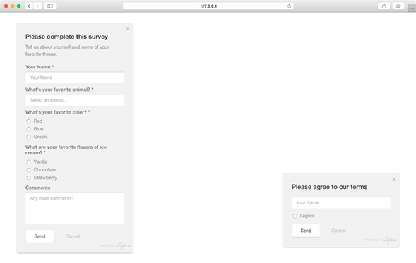

Pathfora now allows for fully customized form fields for modules of type [form](/types/form.md) and [gate](/types/form.md). These input fields include text, texarea, select, checkbox, and radio button.

Try out our [form schema builder](/customization/form_builder.md) to easily build forms with a drag and drop interface and output a `formElements` object for your module config.

Legacy form documentation is also available [here](/customization/form_lagacy.md)

## formElements

This is a list of form element objects to include in the module's form. The order of these elements determines the order in which they render in the module.

<table>
  <thead>
    <tr>
      <td colspan="3" align="center">object in <code>formElements</code> array</td>
    </tr>
    <tr>
      <th>Key</th>
      <th>Type</th>
      <th>Behavior</th>
    </tr>
  </thead>

  <tr>
    <td>type</td>
    <td>string</td>
    <td>type of form element: checkbox-group, radio-group, select, text, or textarea</td>
  </tr>
  <tr>
    <td>name</td>
    <td>string</td>
    <td>name attribute of the field, this is the primary identifier used in tracking</td>
  </tr>
  <tr>
    <td>label</td>
    <td>string</td>
    <td><code>optional</code> label to give the field context to the user/td>
  </tr>
  <tr>
    <td>placeholder</td>
    <td>string</td>
    <td><code>optional</code> placeholder text for text input, textarea, and select fields</td>
  </tr>
  <tr>
    <td>values</td>
    <td>array</td>
    <td><code>optional</code> list of options for checkbox, radio, or select elements.</td>
  </tr>
</table>

<table>
  <thead>
    <tr>
      <td colspan="3" align="center">object in <code>values</code> array</td>
    </tr>
    <tr>
      <th>Key</th>
      <th>Type</th>
      <th>Behavior</th>
    </tr>
  </thead>

  <tr>
    <td>label</td>
    <td>string</td>
    <td>the value of the option shown in the form to the user</td>
  </tr>
  <tr>
    <td>value</td>
    <td>string</td>
    <td>the value attribute of the option or input element, used in tracking</td>
  </tr>
</table>

<h3>Custom Forms - <a href="../../examples/preview/customization/form/custom.html" target="_blank">Live Preview</a></h3>

<pre data-src="../../examples/src/customization/form/custom.js"></pre>

## success

Set a custom success/confirmation message to show after the user submits a form before hiding the module.

<table>
  <thead>
    <tr>
      <td colspan="3" align="center"><code>success</code> object</td>
    </tr>
    <tr>
      <th>Key</th>
      <th>Type</th>
      <th>Behavior</th>
    </tr>
  </thead>

  <tr>
    <td>headline</td>
    <td>string</td>
    <td>header or title text for the success state</td>
  </tr>
  <tr>
    <td>msg</td>
    <td>string</td>
    <td>text message content of the success state</td>
  </tr>
  <tr>
    <td>delay</td>
    <td>int</td>
    <td>how long in seconds to show the success state before hiding the module. if 0, the module will not hide until the user closes it.</td>
  </tr>
</table>

<h3>Success State - <a href="../../examples/preview/customization/form/success.html" target="_blank">Live Preview</a></h3>

<pre data-src="../../examples/src/customization/form/success.js"></pre>

