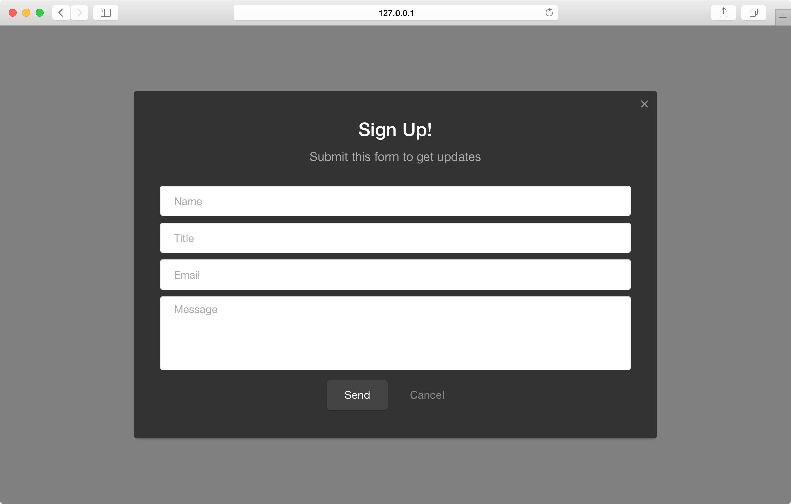
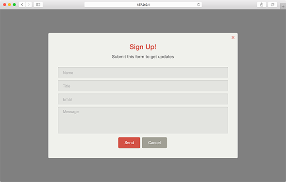

Pathfora has two basic built-in color themes, light (default if no theme is set) and dark. Furthermore, the user can set their own custom colors for any element of the module within the javascript configuration. For more advanced color and style customization you can [add your own CSS](/customization/css.md).

## theme
Set the color scheme of the module, this can be a predefined theme or indicate that the module should have custom colors.

<table>
  <thead>
    <tr>
      <td colspan="3" align="center"><code>theme</code> string</td>
    </tr>
    <tr>
      <th>Value</th>
      <th>Behavior</th>
    </tr>
  </thead>
  
  <tr>
    <td>light</td>
    <td><code>default</code> default light color scheme</td>
  </tr>
  <tr>
    <td>dark</td>
    <td>a predefined darker color scheme</td>
  </tr>
  <tr>
    <td>custom</td>
    <td>the user should define custom colors using <code>colors</code></td>
  </tr>
</table>

### Dark Theme - [Live Preview](../../examples/preview/customization/themes/dark.html)

<pre data-src="../../examples/src/customization/themes/dark.js"></pre>

## colors
Define a set of custom colors for each element of the module.

<table>
  <thead>
    <tr>
      <td colspan="3" align="center"><code>colors</code> obj</td>
    </tr>
    <tr>
      <th>Field</th>
      <th>Type</th>
      <th>Behavior</th>
    </tr>
  </thead>

  <tr>
    <td>background</td>
    <td>string</td>
    <td><code>optional</code> hex color code for the background of the module</td>
  </tr>
  <tr>
    <td>text</td>
    <td>string</td>
    <td><code>optional</code> hex color code for the msg text</td>
  </tr>
  <tr>
    <td>headline</td>
    <td>string</td>
    <td><code>optional</code> hex color code for the headline text</td>
  </tr>
  <tr>
    <td>close</td>
    <td>string</td>
    <td><code>optional</code> hex color code for close button ("X" in the corner)</td>
  </tr>
  <tr>
    <td>actionBackground</td>
    <td>string</td>
    <td><code>optional</code> hex color code for the background of the "confirm" button</td>
  </tr>
  <tr>
    <td>actionText</td>
    <td>string</td>
    <td><code>optional</code> hex color code for the text of the "confirm" button</td>
  </tr>
  <tr>
    <td>cancelBackground</td>
    <td>string</td>
    <td><code>optional</code> hex color code for the background of the "cancel" button</td>
  </tr>
  <tr>
    <td>cancelText</td>
    <td>string</td>
    <td><code>optional</code> hex color code for the text of the "cancel" button</td>
  </tr>
  <tr>
    <td>fieldBackground</td>
    <td>string</td>
    <td><code>optional</code> hex color code for the background of field elements</td>
  </tr>
</table>

### Custom Theme - [Live Preview](../../examples/preview/customization/themes/custom.html)

<pre data-src="../../examples/src/customization/themes/custom.js"></pre>