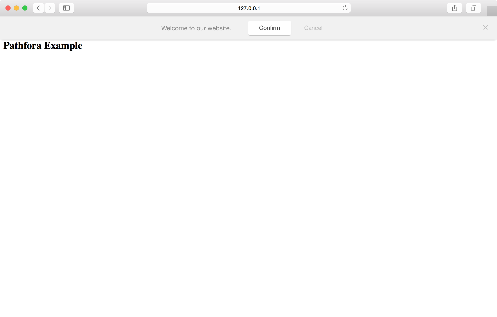

A bar is a thin module which appears at the top or bottom of the browser window.

**Note:** the bar module does not support the `headline` config property.

## position

Position of the bar module relative to the browser window.

<table>
  <thead>
    <tr>
      <td colspan="2" align="center"><code>position</code> string</td>
    </tr>
    <tr>
      <th>Value</th>
      <th>Behavior</th>
    </tr>
  </thead>
  
  <tr>
    <td>top</td>
    <td><code>default</code> module is absolutely positioned to the top of the window</td>
  </tr>
  <tr>
    <td>top-fixed</td>
    <td>module sticks to the top of the window when scrolling</td>
  </tr>
  <tr>
    <td>bottom-fixed</td>
    <td>module sticks to the bottom of the window when scrolling</td>
  </tr>
</table>

<h3>Positions - <a href="../../examples/preview/layouts/bar/positions.html" target="_blank">Live Preview</a></h3>

<pre data-src="../../examples/src/layouts/bar/positions.js"></pre>

### positionSelector

Optionally define the DOM selector of the parent element you would like to insert the module into an element besides the document body.

**Note**: Depending on which `position` your bar has, it may or may not "appear" within your selected element. `top-fixed` and `bottom-fixed` use the `position: fixed` css rule, so while the HTML for your bar will be inserted into the DOM element defined by `positionSelector` it will appear fixed and full width on the page.

<table>
  <thead>
    <tr>
      <td colspan="2" align="center"><code>positionSelector</code> string</td>
    </tr>
    <tr>
      <th>Value</th>
      <th>Behavior</th>
    </tr>
  </thead>
  <tr>
    <td>selector</td>
    <td>Javascript selector of an existing div on the page where the module should appear.</td>
  </tr>
</table>

<h3>Custom Position - <a href="../../examples/preview/layouts/bar/positionSelector.html" target="_blank">Live Preview</a></h3>

<pre data-src="../../examples/src/layouts/bar/positionSelector.js"></pre>

## variant

Variant determines any extra content that may be used by the module.

<table>
  <thead>
    <tr>
      <td colspan="2" align="center"><code>variant</code> int</td>
    </tr>
    <tr>
      <th>Value</th>
      <th>Behavior</th>
    </tr>
  </thead>
  
  <tr>
    <td>1</td>
    <td><code>default</code> text-only-module</td>
  </tr>
  <tr>
    <td>2</td>
    <td>module includes an image</td>
  </tr>
</table>

## image

Define the featured image you would like to use for the module.

**Note:** This setting is only valid for modules with a variant value of 2.

<table>
  <thead>
    <tr>
      <th>Key</th>
      <th>Type</th>
      <th>Behavior</th>
    </tr>
  </thead>
  
  <tr>
    <td>image</td>
    <td>string</td>
    <td>URL of the image to feature</td>
  </tr>
</table>

<h3>Image (variant 2) - <a href="../../examples/preview/layouts/bar/image.html" target="_blank">Live Preview</a></h3>

<pre data-src="../../examples/src/layouts/bar/image.js"></pre>

## pushDown

For `top` or `top-fixed` positioned bars, we can select an element to push down (add a top margin) so it doesn't get covered by the module. This is especially helpful for a top-aligned site navigation.

<table>
  <thead>
    <tr>
      <th>Key</th>
      <th>Type</th>
      <th>Behavior</th>
    </tr>
  </thead>
  
  <tr>
    <td>pushDown</td>
    <td>string</td>
    <td>selector of the element that should move down with the bar</td>
  </tr>
  <tr>
</table>

<h3><a href="../../examples/preview/layouts/bar/pushdown.html" target="_blank">Live Preview</a></h3>

<pre data-src="../../examples/src/layouts/bar/pushdown.js"></pre>
