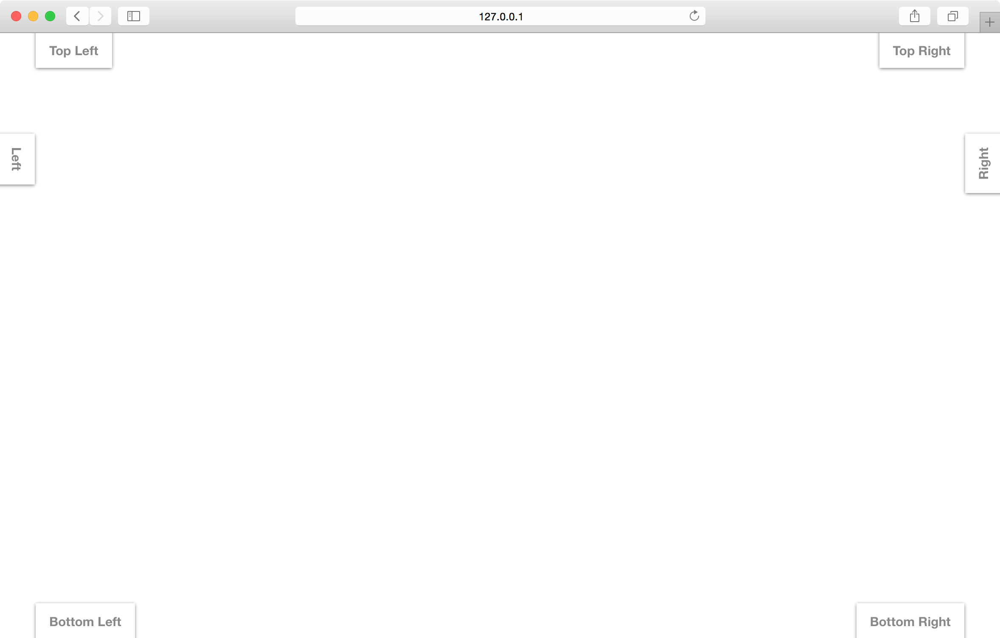

A small module which only allows for a short piece of text, and a single click action. Because of their limited size and capabilities, button modules are best used for short messages, such as calling out a new site feature, or directing a user to a new piece of content.

## position

Positition of the button module relative to the browser window.

<table>
  <thead>
    <tr>
      <td colspan="2" align="center"><code>position</code> string</td>
    </tr>
    <tr>
      <th>Value</th>
      <th>Behavior</th>
    </tr>
  </thead>
  
  <tr>
    <td>top-left</td>
    <td><code>default</code> display the module in the top left corner of the window</td>
  </tr>
  <tr>
    <td>top-right</td>
    <td>display the module in the top right corner of the window</td>
  </tr>
  <tr>
    <td>left</td>
    <td>display the module so that it sticks to the left side of the window</td>
  </tr>
  <tr>
    <td>right</td>
    <td>display the module so that it sticks to the right side of the window</td>
  </tr>
  <tr>
    <td>bottom-right</td>
    <td>display the module in the bottom right corner of the window</td>
  </tr>
  <tr>
    <td>bottom-left</td>
    <td>display the module in the bottom left corner of the window</td>
  </tr>
</table>

<h3>Positions - <a href="../../examples/preview/layouts/button/positions.html" target="_blank">Live Preview</a></h3>

<pre data-src="../../examples/src/layouts/button/positions.js"></pre>