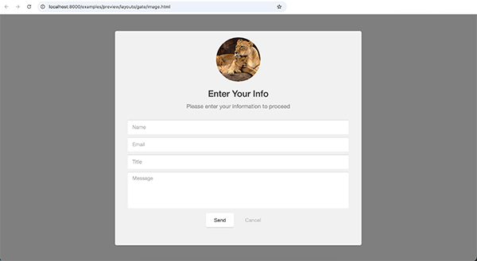

Gate modules prevents users from viewing content or navigating until the user interacts with the content of the gate. Similar to the Modal layout, but without the "x" option to close it. These modules are highly effective when promoting white papers or other online materials that are not to be freely available.

```javascript
var module = new pathfora.Message({
  id: 'my-gate-module-id',
  layout: 'gate',
  headline: 'My Headline Text',
  msg: 'My message text here.',
});

pathfora.initializeWidgets([module]);
```

Gate modules will remain hidden once the user has submitted their information once. A cookie `PathforaUnlocked_[id of module]` is created to save this status so that the user has access to the gated content as long as their cookies persist.

## image

Define the featured image you would like to use for the module.

<table>
  <thead>
    <tr>
      <th>Key</th>
      <th>Type</th>
      <th>Behavior</th>
    </tr>
  </thead>
  
  <tr>
    <td>image</td>
    <td>string</td>
    <td>URL of the image to feature</td>
  </tr>
</table>

<h3>Image - <a href="../../examples/preview/layouts/gate/image.html" target="_blank">Live Preview</a></h3>



<pre data-src="../../examples/src/layouts/gate/image.js"></pre>
