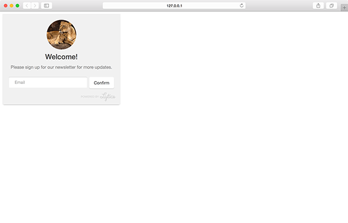
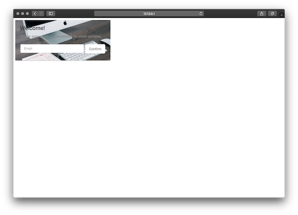
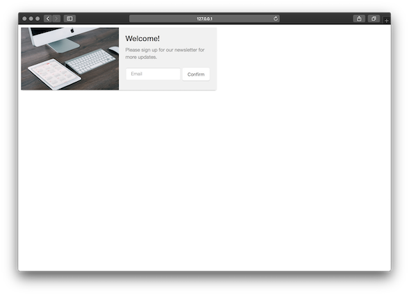

An inline module can be inserted into an existing `
` element on your page. This allows you to render personalized messages and forms anywhere on your page.

**Note:** inline modules do not support the close or cancel option. Clicking the confirm button will trigger [success state](/customization/form.md#success) for form or subscription modules, but we recommend setting a [custom callback](/callbacks.md) for the confirm button of a inline message module.

## position

Position determines the HTML element that should contain the inline module.

<table>
  <thead>
    <tr>
      <td colspan="2" align="center"><code>position</code> string</td>
    </tr>
    <tr>
      <th>Value</th>
      <th>Behavior</th>
    </tr>
  </thead>

  <tr>
    <td>selector</td>
    <td>Javascript selector of an existing div on the page where the module should appear.</td>
  </tr>
</table>

<h3>Positions - <a href="../../examples/preview/layouts/inline/positions.html" target="_blank">Live Preview</a></h3>

<pre data-src="../../examples/src/layouts/inline/positions.js"></pre>

## variant

Variant determines any extra content that may be used by the module.

<table>
  <thead>
    <tr>
      <td colspan="2" align="center"><code>variant</code> int</td>
    </tr>
    <tr>
      <th>Value</th>
      <th>Behavior</th>
    </tr>
  </thead>

  <tr>
    <td>1</td>
    <td><code>default</code> text-only-module</td>
  </tr>
  <tr>
    <td>2</td>
    <td>module includes an image</td>
  </tr>
  <tr>
    <td>3</td>
     <td>module includes a <a href="../../content_recommend">content recommendation</a></td>
  </tr>
  <tr>
    <td>4</td>
    <td>module includes a background image</td>
  </tr>
</table>

## image

Define the featured image you would like to use for the module.

**Note:** This setting is only valid for modules with a variant value of 2.

<table>
  <thead>
    <tr>
      <th>Key</th>
      <th>Type</th>
      <th>Behavior</th>
    </tr>
  </thead>

  <tr>
    <td>image</td>
    <td>string</td>
    <td>URL of the image to feature</td>
  </tr>
</table>

<h3>Image (variant 2) - <a href="../../examples/preview/layouts/inline/image.html" target="_blank">Live Preview</a></h3>

<pre data-src="../../examples/src/layouts/inline/image.js"></pre>

## background image

Define the background image and position you would like to use for the module.

**Note:** This setting is only valid for modules with a variant value of 2.

<table>
  <thead>
    <tr>
      <td colspan="3" align="center"><code>backgroundImage</code> object</td>
    </tr>
    <tr>
      <th>Key</th>
      <th>Type</th>
      <th>Behavior</th>
    </tr>
  </thead>

  <tr>
    <td>src</td>
    <td>string</td>
    <td>URL of the image</td>
  </tr>

  <tr>
    <td>position</td>
    <td>string</td>
    <td><code>optional</code> position of the image: top, bottom, right, or left</td>
  </tr>
</table>

<h3>Customzing position</h3>

The position of the background image and the text block can be tweaked with <a href="../../customization/css">custom css</a>.

<h3>Background Image (variant 4) - <a href="../../examples/preview/layouts/inline/backgroundImage.html" target="_blank">Live Preview</a></h3>

<pre data-src="../../examples/src/layouts/inline/backgroundImage.js"></pre>

<h3>Background Image with Position (variant 4) - <a href="../../examples/preview/layouts/inline/backgroundImagePosition.html" target="_blank">Live Preview</a></h3>

<pre data-src="../../examples/src/layouts/inline/backgroundImagePosition.js"></pre>