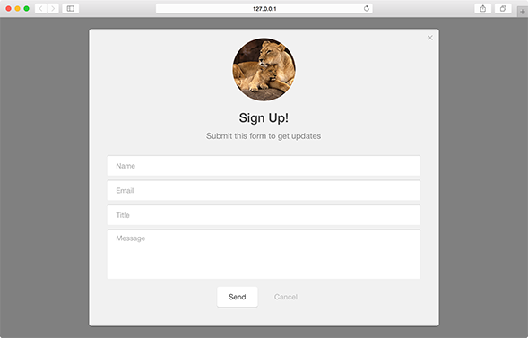

A modal is a large size module with an overlay behind it. It's meant to cover a substantial area of the browser window, so that it demands attention from the user.

## variant

Variant determines any extra content (dictated by extra keys in the config) that may be used by the module.

<table>
  <thead>
    <tr>
      <td colspan="2" align="center"><code>variant</code> int</td>
    </tr>
    <tr>
      <th>Value</th>
      <th>Behavior</th>
    </tr>
  </thead>
  
  <tr>
    <td>1</td>
    <td><code>default</code> text-only-module</td>
  </tr>
  <tr>
    <td>2</td>
    <td>module includes an image</td>
  </tr>
  <tr>
    <td>3</td>
    <td>module includes a <a href="../../content_recommend">content recommendation</a> (this feature is in <strong>beta</strong>)</td>
  </tr>
</table>

## image

Define the featured image you would like to use for the module.

**Note:** This setting is only valid for modules with a variant value of 2.

<table>
  <thead>
    <tr>
      <th>Key</th>
      <th>Type</th>
      <th>Behavior</th>
    </tr>
  </thead>
  
  <tr>
    <td>image</td>
    <td>string</td>
    <td>URL of the image to feature</td>
  </tr>
</table>

<h3>Image (variant 2) - <a href="../../examples/preview/layouts/modal/image.html" target="_blank">Live Preview</a></h3>

<pre data-src="../../examples/src/layouts/modal/image.js"></pre>
