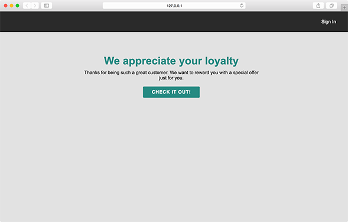

Beyond it's modules, the Pathfora library can also show or hide inline content based on audience membership. With a little bit of HTML and some specially named attributes you can begin seemlessly personalizing the content of your website to fit targetted audiences.

``` html
<!-- This content will show to first-time visitors -->
<div data-pfgroup="my-personalized-group" data-pftrigger="new_user">
  You must be new here! Please take a look at our guide for new users.
</div>

<!-- This content will show to returning visitors -->
<div data-pfgroup="my-personalized-group" data-pftrigger="returning">
  Thanks for coming back, why not check out our blog for the newest updates?
</div>
```

You must load the [Lytics Javascript Tag](https://learn.lytics.com/understanding/product-docs/lytics-javascript-tag/) to toggle elements based on audience membership. Pathfora interacts with this tag to retrieve the a list of Lytics audiences that the user is a member of and will select which elements to show/hide based on this list.


## Setup Your Audiences
You will need to have at least one audience built in Lytics that you want to target with a module. Make sure that you have API access enabled for the audience, and have entered an ID. You will use this id as the value of the `data-pftrigger` attribute.


## Attributes
Each toggleable piece of content should have a surrounding container HTML element. This element can be of any type and must have the following two attributes.

<table>
  <thead>
    <tr>
      <td colspan="3" align="center">HTML data <code>attribute</code></td>
    </tr>
    <tr>
      <th>Attribute</th>
      <th>Value Type</th>
      <th>Value</th>
    </tr>
  </thead>

  <tr>
    <td>data-pfgroup</td>
    <td>string</td>
    <td>a unique string name for the set of elements to group together</td>
  </tr>
  <tr>

  <tr>
    <td>data-pftrigger</td>
    <td>string</td>
    <td>id or slug of the audience in Lytics or <code>default</code></td>
  </tr>
</table>

If you have multiple elements with the same `pfgroup` name, only the first element with a matching `pftrigger` value will show. This means at most only one piece of content in a group will show.

Additionally, if the user is not a member of one of these audiences you can create a default piece of content and set the `pftrigger` value to be `default`. This default element will only show if the user is not a member of any other `pftrigger` audience in a group.

**Note:** Pathfora loads some CSS to hide the toggle elements before selecting which element to show. Because the js library will load after the body of the page, you may see a flicker of html elements when the page is first loaded. To prevent this, you can add the following line of CSS to the stylesheet of your website:

```css
[data-pftrigger], [data-pfrecommend]{ display: none; }
```

<h3>Content Element Toggle - <a href="../examples/preview/inline/toggle.html" target="_blank">Live Preview</a></h3>

You can check which audiences you are a member of by typing `lio.data.segments` into a console log. If you are in the `high_value` or `registered_users` audience you should see the appropriate content, otherwise you will see the default options.



<pre data-src="../examples/src/inline/toggle.html"></pre>
