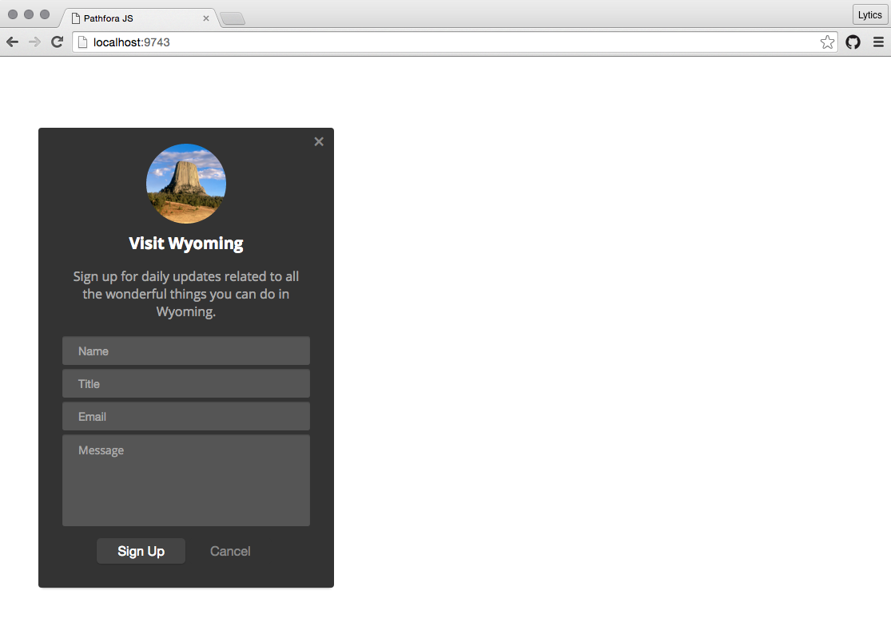
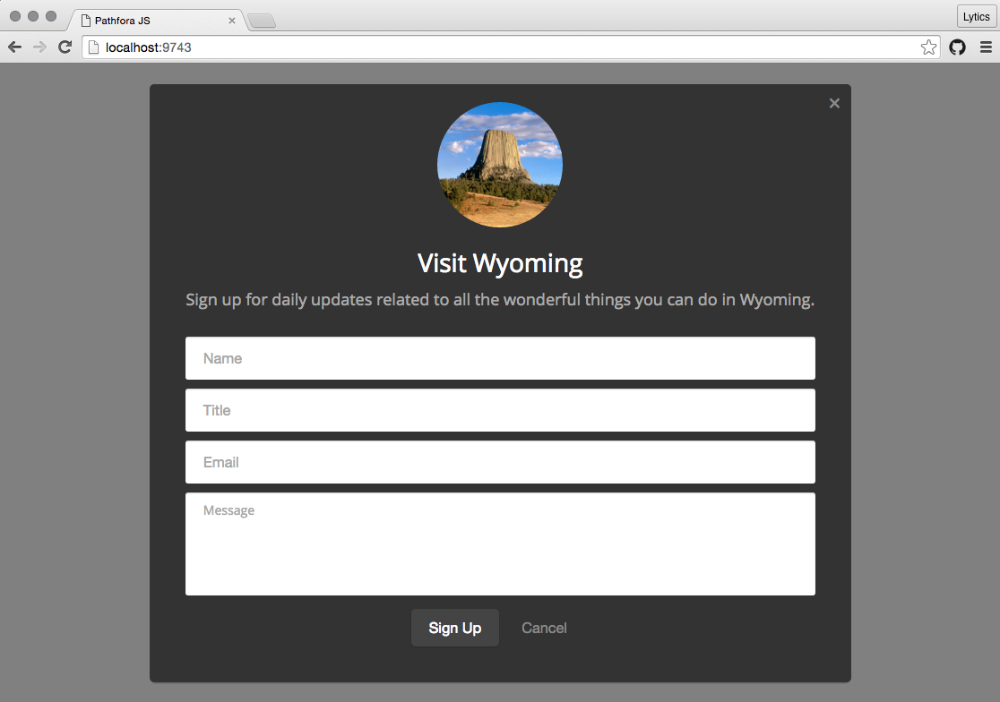

## Overview
Used primarily for data collection or user identification. Supporting a variety of form fields and options for passing data to various end-points this type presents a form for the user to fill out and submit. 

## Examples

