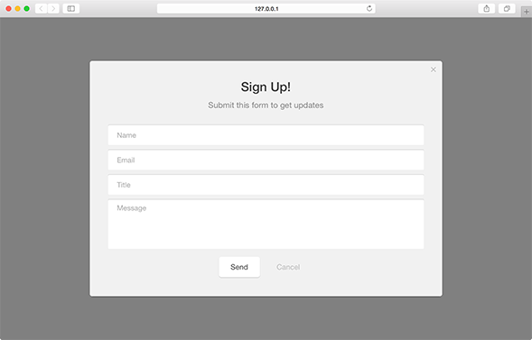
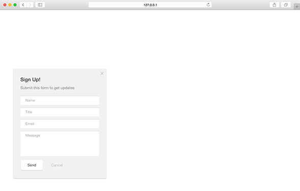
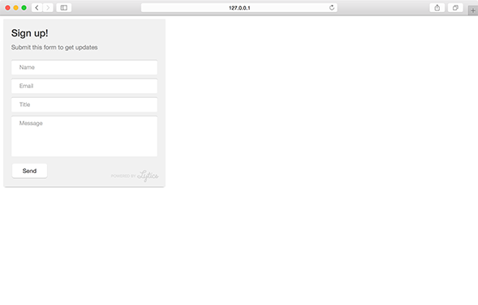
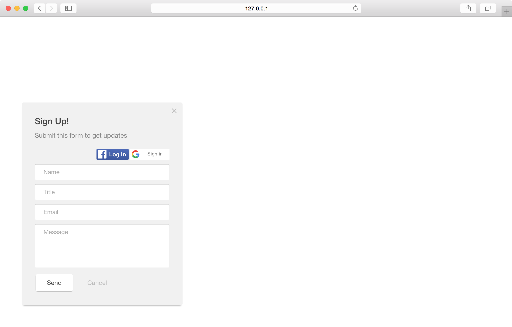

Form type modules are used primarily for data collection or user identification. Supporting a variety of form fields and options for passing data to various end-points, this type presents a form for the user to fill out and submit.

``` javascript
var module = new pathfora.Form({
  id: 'my-form-module-id',
  headline: 'My Headline Text',
  msg: 'My message text here.'
});

pathfora.initializeWidgets([module]);
```

## layout

Define which layout type the form module should use.

<table>
  <thead>
    <tr>
      <td colspan="2" align="center"><code>layout</code> string</td>
    </tr>
    <tr>
      <th>Value</th>
      <th>Behavior</th>
    </tr>
  </thead>
  
  <tr>
    <td>modal</td>
    <td>module uses a <a href="../../layouts/modal">modal layout</a></td>
  </tr>
  <tr>
    <td>slideout</td>
    <td>module uses a <a href="../../layouts/slideout">slideout layout</a></td>
  </tr>
  <tr>
    <td>inline</td>
    <td>module uses a <a href="../../layouts/inline">inline layout</a></td>
  </tr>
</table>


<h3>Form - <a href="../../examples/preview/types/form/modal.html" target="_blank">Live Preview</a></h3>



<pre data-src="../../examples/src/types/form/modal.js"></pre>


<h3>Slideout - <a href="../../examples/preview/types/form/slideout.html" target="_blank">Live Preview</a></h3>



<pre data-src="../../examples/src/types/form/slideout.js"></pre>


<h3>Inline - <a href="../../examples/preview/types/form/inline.html" target="_blank">Live Preview</a></h3>



<pre data-src="../../examples/src/types/form/inline.js"></pre>


## showSocialLogin

With social login enabled, a module can show Google or Facebook login buttons which the user can use to connect to their account. This will autofill the form elements with their account information such as name and email. This setting requires authentication with [integrateWithFacebook](/api/methods.md#integratewithfacebook) or [integrateWithGoogle](/api/methods.md#integratewithgoogle).

<table>
  <thead>
    <tr>
      <td colspan="2" align="center"><code>showSocialLogin</code> boolean</td>
    </tr>
    <tr>
      <th>Value</th>
      <th>Behavior</th>
    </tr>
  </thead>
  
  <tr>
    <td>false</td>
    <td><code>default</code> do not show social login buttons</td>
  </tr>
  <tr>
    <td>true</td>
    <td>show social login buttons</td>
  </tr>
</table>

<h3>Social Login /w Google &amp; Facebook - <a href="../../examples/preview/types/form/social.html" target="_blank">Live Preview</a></h3>



<pre data-src="../../examples/src/types/form/social.js"></pre>