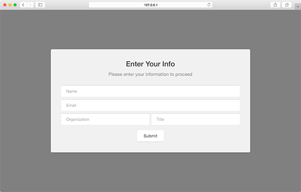
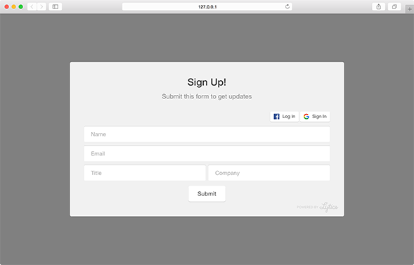
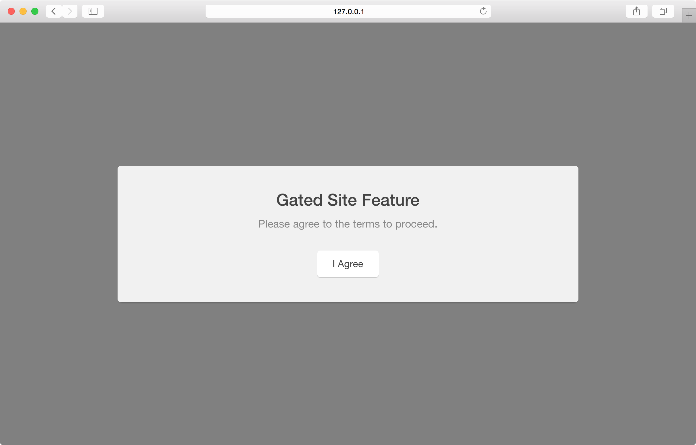

Gate modules provide an approach for requiring data collection or user identification. This type of module prevents users from viewing content or navigating until some sort of data has been collected and processed. These modules are highly effective when promoting white papers or other online materials that are not to be freely available.

``` javascript
var module = pathfora.SiteGate({
  id: 'my-gate-module-id',
  headline: 'My Headline Text',
  msg: 'My message text here.'
});

pathfora.initializeWidgets([ module ]);
```

## Gate

Gate modules will remain hidden once the user has submitted their information once. A cookie `PathforaUnlocked_[id of module]` is created to save this status so that the user has access to the gated content as long as their cookies persist.

### SiteGate - [Live Preview](../examples/preview/types/gate/gate.html)



<pre data-src="../../examples/src/types/gate/gate.js"></pre>


## showSocialLogin

With social login enabled, a module can show Google or Facebook login buttons which the user can use to connect to their account. This will autofill the form elements with their account information such as name and email. This setting requires authentication with [integrateWithFacebook](/api/methods.md#integratewithfacebook) or [integrateWithGoogle](/api/methods.md#integratewithgoogle).

<table>
  <thead>
    <tr>
      <td colspan="2" align="center"><code>showSocialLogin</code> boolean</td>
    </tr>
    <tr>
      <th>Value</th>
      <th>Behavior</th>
    </tr>
  </thead>
  
  <tr>
    <td>false</td>
    <td><code>default</code> do not show social login buttons</td>
  </tr>
  <tr>
    <td>true</td>
    <td>show social login buttons</td>
  </tr>
</table>

### Social Login /w Google & Facebook - [Live Preview](../examples/preview/types/gate/social.html)



<pre data-src="../../examples/src/types/gate/social.js"></pre>

## showForm

By default the a gate module includes a form, with this setting it can be hidden for a text-only gated widget.

<table>
  <thead>
    <tr>
      <td colspan="2" align="center"><code>showForm</code> boolean</td>
    </tr>
    <tr>
      <th>Value</th>
      <th>Behavior</th>
    </tr>
  </thead>
  
  <tr>
    <td>true</td>
    <td><code>default</code> show the gated form</td>
  </tr>
  <tr>
    <td>false</td>
    <td>hide the form for a text-only gated widget</td>
  </tr>
</table>

### Text-only Gate - [Live Preview](../examples/preview/types/gate/showForm.html)



<pre data-src="../../examples/src/types/gate/showForm.js"></pre>