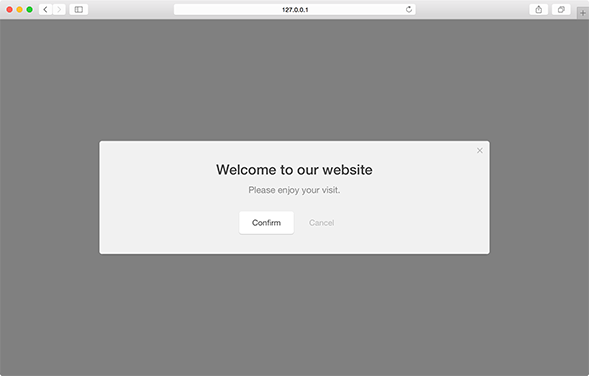
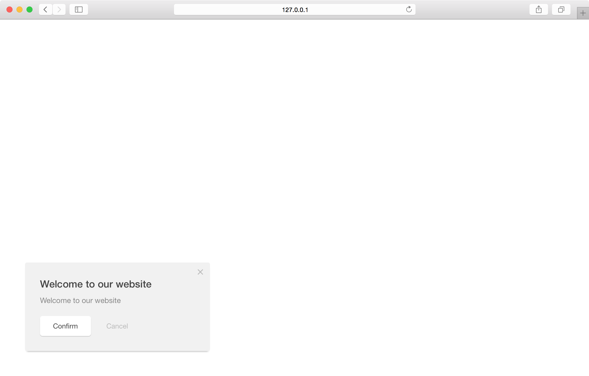
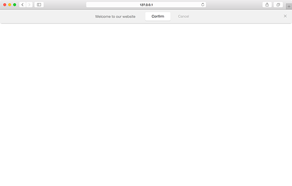

Focused on deliverying outbound communication. Perhaps announcing a product launch, new content, top-level alert, etc. Message modules are simple text modules which can be used in a variety of formats.

``` javascript
var module = pathfora.Message({
	// module settings
});

pathfora.initializeWidgets([ module ]);
```


## layout

Define which layout type the form module should use.

| Value | Type | Behavior |
|---|---|---|
| modal | string | module uses a [modal layout](../layouts/modal.md) |
| slideout | string | module uses a [slideout layout](../layouts/slideout.md) |
| bar | string | module uses a [bar layout](../layouts/bar.md) |  
| button | string | module uses a [button layout](../layouts/button.md) |  

### Modal - [Live Preview](../../examples/preview/types/message/modal.html)



<pre data-src="../../examples/src/types/message/modal.js"></pre>


### Slideout - [Live Preview](../../examples/preview/types/message/slideout.html)



<pre data-src="../../examples/src/types/message/slideout.js"></pre>


### Bar - [Live Preview](../../examples/preview/types/message/bar.html)



<pre data-src="../../examples/src/types/message/bar.js"></pre>


### Button - [Live Preview](../../examples/preview/types/message/button.html)


<pre data-src="../../examples/src/types/message/button.js"></pre>
