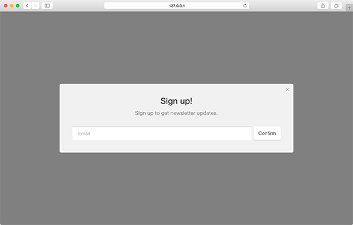
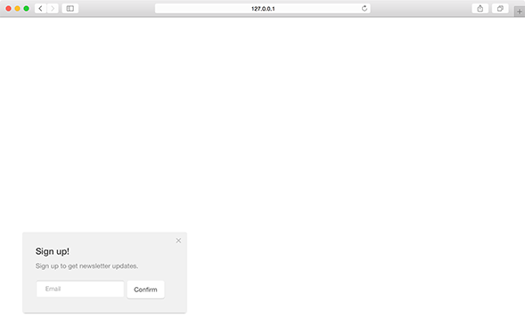
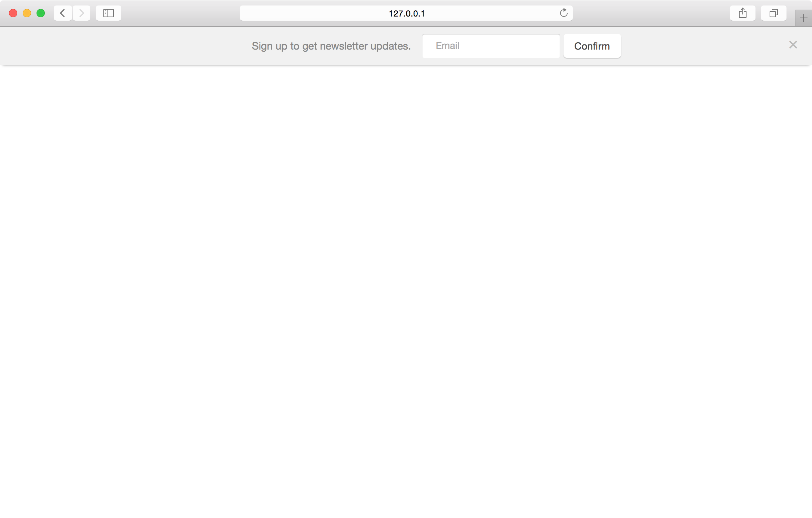

Subscription modules are a lite version of the form type focused on gathering the minimum amount of user data necessary to maintain communication. By default only email address will be collected by a subscription module.

``` javascript
var module = pathfora.Subscription({
  id: 'my-subscription-module-id',
  headline: 'My Headline Text',
  msg: 'My message text here.'
});

pathfora.initializeWidgets([ module ]);
```

## layout

Define which layout type the form module should use.

<table>
  <thead>
    <tr>
      <td colspan="2" align="center"><code>layout</code> string</td>
    </tr>
    <tr>
      <th>Value</th>
      <th>Behavior</th>
    </tr>
  </thead>
  
  <tr>
    <td>modal</td>
    <td>module uses a <a href="/layouts/modal">modal layout</a></td>
  </tr>
  <tr>
    <td>slideout</td>
    <td>module uses a <a href="/layouts/slideout">slideout layout</a></td>
  </tr>
  <tr>
    <td>bar</td>
    <td>module uses a <a href="/layouts/bar">bar layout</a></td>
  </tr>
</table>

### Modal - [Live Preview](../../examples/preview/types/subscription/modal.html)



<pre data-src="../../examples/src/types/subscription/modal.js"></pre>


### Slideout - [Live Preview](../../examples/preview/types/subscription/slideout.html)



<pre data-src="../../examples/src/types/subscription/slideout.js"></pre>


### Bar - [Live Preview](../../examples/preview/types/subscription/bar.html)



<pre data-src="../../examples/src/types/subscription/bar.js"></pre>
